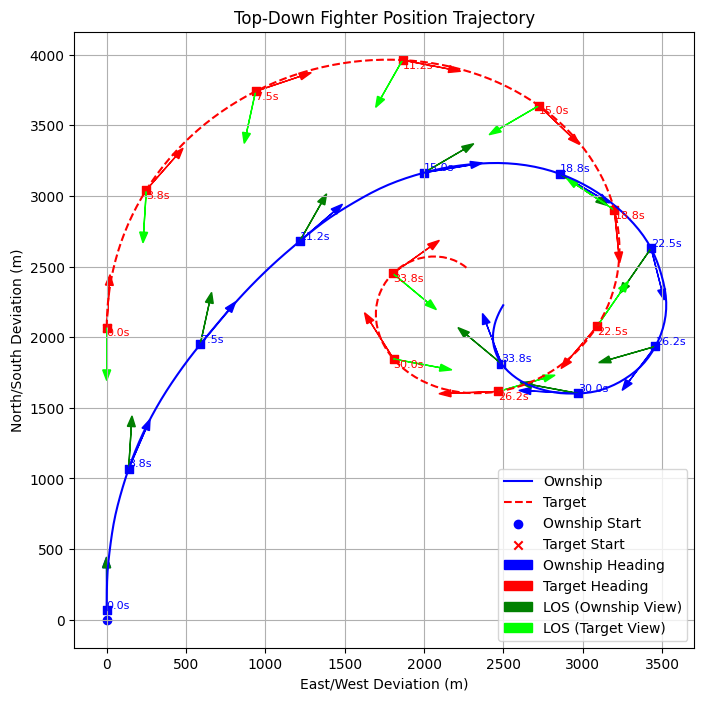

# Beyond Maneuvers: Teaching AI Pilots to Dogfight with Principles

Can an AI master aerial combat not by imitation, but by understanding the principles of dogfighting?  
This project explores that question using reinforcement learning, physics-based simulation, and tactical reasoning—enabling AI agents to discover classic air combat maneuvers purely from first principles.

## Core Idea

Traditional flight training teaches specific moves like the Immelmann or High YoYo. But real pilots win fights through mastery of position, energy, and timing—not memorized patterns.

This project encodes those BFM (Basic Fighter Maneuver) principles into a universal reward function, inspired by Col. John Boyd’s Energy-Maneuverability (EM) theory. The AI is never taught maneuvers—it invents them by maximizing tactical advantage in simulation.

## Tech Stack

- JSBSim – High-fidelity aerodynamics and flight physics engine  
- Gymnasium + Stable Baselines3 – Reinforcement learning training loop  
- Matplotlib + FlightGear – Flight metric visualization and full 3D replays  

## Experiments and Results

### Experiment 1: Lead Pursuit (2D Positioning Only)

**Scenario:**  
Tail-chase between two F-16s, attacker starts 2000m behind  
**Controls:** Pitch and throttle only  
**Observations:** Distance, angle off nose, aspect, closure rate, own speed and G-force  

**Reward Function:**  
A smooth zero-sum reward based on ideal gun range, rear aspect, and velocity alignment.

**Learning Progression:**

- **7,500 Steps (≈30 minutes simulated flight):**  
  AI begins to cut into the bandit’s turn but cannot yet maintain position  
  

- **46,500 Steps (≈3 hours simulated flight):**  
  AI starts tightening its turn after interception, though still inconsistent  
  

- **75,000 Steps (≈5 hours simulated flight):**  
  AI successfully maintains a textbook lead pursuit with stable distance  
  

**Result:**  
By 75,000 steps, the AI discovers and maintains an effective lead pursuit, gaining multiple gun employment windows.

### Experiment 2: High YoYo (3D Position and Energy Awareness)

**Scenario:**  
Same setup, but attacker starts at 1200 ft/s—too fast to sustain a tight horizontal turn  
**Controls:** Throttle, pitch, and roll  
**Reward Function:**  
Extended to include potential energy (altitude), enabling reasoning about vertical trade-offs

**Learning Progression:**

- **30,000 Steps (≈2 hours simulated flight):**  
  AI attempts horizontal turns but overshoots due to excessive speed  
  

- **100,000 Steps (≈7 hours simulated flight):**  
  AI starts climbing to trade speed for altitude  
  

- **200,000 Steps (≈14 hours simulated flight):**  
  AI learns tighter turns via energy trading but doesn’t fully re-engage  
  

- **300,000 Steps (≈20 hours simulated flight):**  
  AI completes full High YoYo maneuver, regaining position and control  
  

**Result:**  
By 300,000 steps, the AI performs a full High YoYo, intelligently managing closure by converting energy into vertical space and back.

## Next Steps

- Maneuver generalization: lag pursuit, barrel roll, low yoyo, scissors  
- Cross-airframe adaptation: test with F-15, MiG-29, F/A-18, etc.  
- Combat integration: reward extensions for missile/gun employment windows  
- Multi-agent combat: 2v1 cooperative tactics and team-based dogfights  
- Adaptive AI: vary enemy tactics to test general reasoning and responsiveness  

## Background

This research builds on the legacy of Col. John Boyd’s Energy-Maneuverability theory, which formalized the role of energy in aerial combat and influenced modern fighter design. By adapting these principles into machine reasoning, we aim to create AI agents that reason and fight like skilled pilots—not pattern-matchers.

## Author

Sean Zhou – Carnegie Mellon CS, Alexa AI, military AI researcher.  
Open to collaboration and research discussions on aerial combat AI and tactical reasoning.

